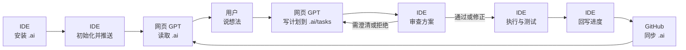

# AI Engineering Delivery OS

> 中文名：AI 工程交付操作系统  
> 定位：一套可安装到任意代码仓库的 AI 多智能体工程协作系统。

开源仓库 URL：

```text
https://github.com/doamz-ai/ai
```

AI Engineering Delivery OS 不是一段单独的 Prompt，也不是某个具体项目的开发文档。它是一套可以安装到任意 GitHub 项目中的 AI 协作运行环境，用来把 AI 编程从“聊天式写代码”升级为“上下文驱动、任务切片、增量实现、测试反馈、质量审计、长期沉淀”的工程交付流程。

---

## 0. 先看三分钟上手流程图

如果你是第一次打开本仓库，先看这里：[`THREE_MINUTE_QUICK_START.md`](./THREE_MINUTE_QUICK_START.md)

下面是紧凑版使用闭环。详细步骤见下方表格。



| 步骤 | 谁负责 | 做什么 |
|---|---|---|
| 1 | IDE | 从 `https://github.com/doamz-ai/ai` 安装 `.ai/` 到当前项目 |
| 2 | IDE | 扫描项目，初始化 `.ai/project/`，并推送到 GitHub |
| 3 | 网页 GPT | 连接目标项目 GitHub，冷启动读取 `.ai/` |
| 4 | 用户 | 用大白话提出想法 |
| 5 | 网页 GPT | 生成 PRD / RFC / Plan / IDE Prompt，只写 `.ai/tasks/` |
| 6 | IDE | pull 最新 `.ai/`，先审查方案，不无脑执行 |
| 7 | IDE | 执行代码任务、运行测试、回写进度到 `.ai/tasks/` |
| 8 | GitHub | 同步 `.ai/`，让网页 GPT 下次继续接上进度 |

一句话记忆：

```text
IDE 负责安装、执行、推送；网页 GPT 负责规划、审计、继续聊；GitHub 的 .ai/ 文件夹负责传话和记忆。
```

---

## 1. 非专业用户快速开始

如果你不懂 Git、脚本或工程目录，也可以这样用。

### 推荐方式：让 IDE 智能体自动安装

在你的任意代码项目中，打开支持 GitHub 和本地文件操作的 AI IDE，然后复制下面这段话给 IDE 智能体：

```markdown
请从 GitHub 开源仓库安装 AI Engineering Delivery OS 到当前项目。

仓库名称：`doamz-ai/ai`
仓库 URL：`https://github.com/doamz-ai/ai`
默认分支：`master`

请先读取该仓库中的 `prompts/install-from-github.md`，然后严格按照其中规则执行。

目标：
1. 在当前项目根目录创建 `.ai/` 文件夹。
2. 从 `https://github.com/doamz-ai/ai` 复制模板内容到 `.ai/`。
3. 不要修改当前项目业务代码。
4. 安装后扫描当前项目，初始化 `.ai/project/` 下的项目上下文。
5. 输出安装报告。
```

安装完成后，当前项目就拥有自己的专属 `.ai/` 协作层。

### 重要：安装后要推送到目标项目 GitHub

如果你希望网页版 ChatGPT 也能辅助这个项目，例如帮你生成 PRD、RFC、任务计划、审计意见或给 IDE 的执行 Prompt，那么只在本地安装 `.ai/` 还不够。

你需要让 IDE 智能体把最新的 `.ai/` 文件夹提交并推送到当前项目的 GitHub 仓库。

推荐对 IDE 智能体补充这段要求：

```markdown
安装并初始化 `.ai/` 后，请把 `.ai/` 文件夹提交并推送到当前项目 GitHub。

要求：
1. 只提交 `.ai/` 相关文件。
2. 不要提交任何业务代码改动。
3. commit message 建议使用：`docs: install AI Engineering Delivery OS`
4. 推送完成后输出 GitHub 仓库、分支、commit sha。
5. 这样网页版 ChatGPT 后续才能连接这个目标项目 GitHub，并读取项目专属 `.ai/` 文件夹来辅助生成 PRD、RFC、任务计划和审计文档。
```

---

## 2. 这个系统解决什么问题？

普通 AI 编程流程通常是：

```text
用户提出模糊想法
→ AI 直接猜需求
→ AI 修改代码
→ 用户发现不对
→ 反复返工
```

这个模式的问题不是 AI 不会写代码，而是缺少工程交付纪律：

- 缺少统一上下文。
- 缺少项目共享语言。
- 缺少需求澄清机制。
- 缺少任务拆解机制。
- 缺少执行边界。
- 缺少测试反馈。
- 缺少执行后审计。
- 缺少长期项目记忆。

AI Engineering Delivery OS 要解决的是：

```text
如何让不同 AI 模型在同一个代码项目里，按统一上下文、统一流程、统一质量门、统一审计标准，高效、低返工、低技术债地交付代码。
```

---

## 3. 协作治理原则

IDE 里的强模型不是无脑执行者，而是带有否决权的工程合作者。

任何网页 GPT、人类或其他模型写入 `.ai/` 的方案，都默认是：

```text
Proposal, not command.
```

IDE 模型在执行前必须基于真实仓库做挑战性审查：

```text
ACCEPT / ACCEPT_WITH_CHANGES / NEEDS_CLARIFICATION / REJECT
```

推荐协作方式：

```text
网页 GPT 讨论并生成方案
→ 写入目标项目 .ai/tasks/...
→ 推送到 GitHub
→ IDE pull 最新内容
→ IDE 审查 .ai/tasks/...
→ IDE 修正或执行
→ IDE 推送代码或 PR
→ 网页 GPT 可再次审计 diff
```

详细见：[`AI_COLLABORATION_PROTOCOL.md`](./AI_COLLABORATION_PROTOCOL.md)

---

## 4. 推荐安装结构

将本系统安装到任意项目根目录下的 `.ai/` 文件夹中：

```text
.ai/
├── README.md
├── THREE_MINUTE_QUICK_START.md
├── START_HERE.md
├── VERSION.md
├── INSTALL.md
├── REMOTE_INSTALL.md
├── AI_COLLABORATION_PROTOCOL.md
├── USER_SCENARIOS_PLAYBOOK.md
├── MANIFEST.md
├── SELF_CHECK.md
├── CHANGELOG.md
├── manifest.json
│
├── system/
├── project/
├── skills/
├── templates/
├── references/
├── prompts/
├── scripts/
├── tasks/
├── decisions/
├── reviews/
└── changelog/
```

---

## 5. 分层设计

| 层 | 作用 |
|---|---|
| `system/` | 通用系统内核：主 Prompt、智能体规则、工作模式、交付流程 |
| `project/` | 项目本地上下文：项目画像、领域词典、上下文地图、长期记忆 |
| `skills/` | 可触发工作流：想法澄清、计划拆解、执行、测试、审计、沉淀 |
| `templates/` | 标准交付物模板：PRD、RFC、ADR、任务包、Review、Ship Report |
| `references/` | 质量门：安全、性能、测试、API、数据库、前端、反过度设计 |
| `prompts/` | 可复制启动 Prompt：安装、冷启动、写入 `.ai/`、审计、进度回写 |
| `tasks/` | 每次真实任务的过程记录 |
| `decisions/` | ADR 架构决策记录 |
| `reviews/` | 代码审计报告 |
| `changelog/` | AI 协作层或项目重要交付变化记录 |

完整清单见：[`MANIFEST.md`](./MANIFEST.md)

---

## 6. 常用文件入口

| 场景 | 文件 |
|---|---|
| 小白快速看懂 | [`THREE_MINUTE_QUICK_START.md`](./THREE_MINUTE_QUICK_START.md) |
| IDE 自动安装 `.ai/` | [`prompts/install-from-github.md`](./prompts/install-from-github.md) |
| 网页 GPT 冷启动 | [`prompts/web-gpt-cold-start.md`](./prompts/web-gpt-cold-start.md) |
| 用户有模糊想法 | [`prompts/raw-idea.md`](./prompts/raw-idea.md) |
| 网页 GPT 写入 `.ai/` | [`prompts/web-gpt-write-ai-folder.md`](./prompts/web-gpt-write-ai-folder.md) |
| IDE 审查网页 GPT 的任务 | [`prompts/ide-review-ai-task.md`](./prompts/ide-review-ai-task.md) |
| IDE 回写执行进度 | [`prompts/ide-progress-report-to-ai-folder.md`](./prompts/ide-progress-report-to-ai-folder.md) |
| 网页 GPT 审计 diff | [`prompts/review-diff.md`](./prompts/review-diff.md) |
| 多场景手册 | [`USER_SCENARIOS_PLAYBOOK.md`](./USER_SCENARIOS_PLAYBOOK.md) |

---

## 7. 标准生命周期

每个重要任务建议遵循以下生命周期：

```text
0. Context：读取上下文与领域语言
1. Define：澄清想法，定义真实问题
2. Spec：形成规格，明确目标和非目标
3. Plan：拆成任务切片，区分 HITL / AFK
4. Prompt：编译给编程智能体的执行 Prompt
5. Build：增量实现，每个切片保持可运行
6. Verify：测试反馈，提供 pass/fail 证据
7. Review：质量门审计，输出 PASS / NEEDS_FIX / REJECT
8. Ship：交付报告，沉淀项目记忆
9. Memory：更新长期项目上下文
```

---

## 8. 关键原则

- **Context before code**：先理解项目上下文，再讨论代码。
- **Proposal, not command**：`.ai/` 中的计划默认是提案，不是命令。
- **Clarify before build**：需求不清时，先澄清，不直接实现。
- **Not Doing is part of scope**：每个任务都要明确“不做什么”。
- **Vertical slices over big rewrites**：优先薄切片，不做一次性大重构。
- **Feedback loop first**：复杂改动先建立可验证信号。
- **Review before trust**：代码执行后必须审计。
- **Memory after ship**：重要任务完成后沉淀项目记忆。

---

## 9. 当前状态

当前版本：`v0.1.1-draft`  
当前状态：Ready for Pilot  
当前目标：支持 IDE 自动远程安装，并支持网页 GPT 与 IDE 通过 GitHub `.ai/` 文件夹协作。
