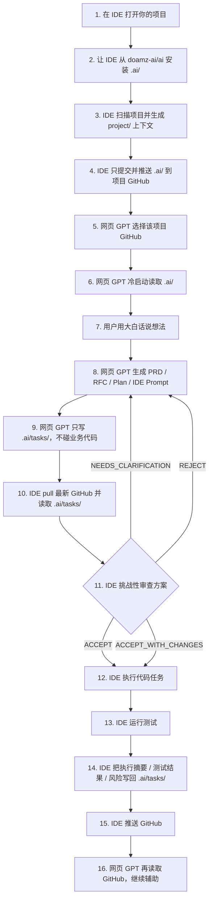

# Three-minute Quick Start

本文件面向非专业 IT 用户，帮助你在 3 分钟内理解 AI Engineering Delivery OS 怎么用。

开源仓库 URL：

```text
https://github.com/doamz-ai/ai
```

你只需要记住一句话：

```text
IDE 负责安装、执行、推送；网页 GPT 负责规划、审计、继续聊；GitHub 的 .ai/ 文件夹负责传话和记忆。
```

---

## 1. 三分钟上手流程图

> 在 GitHub 中打开本文件时，下面的 Mermaid 会自动渲染成流程图。



---

## 2. 文字版流程

```text
第 1 步：在 IDE 打开你的项目
        ↓
第 2 步：让 IDE 从 https://github.com/doamz-ai/ai 安装 .ai/
        ↓
第 3 步：IDE 扫描项目，生成 project/ 项目上下文
        ↓
第 4 步：IDE 只提交并推送 .ai/ 到你的项目 GitHub
        ↓
第 5 步：网页版 GPT 选择你的项目 GitHub
        ↓
第 6 步：网页版 GPT 冷启动读取 .ai/
        ↓
第 7 步：你用大白话说想法
        ↓
第 8 步：网页 GPT 生成 PRD / RFC / Plan / 给 IDE 的 Prompt
        ↓
第 9 步：网页 GPT 只把产物写入 .ai/tasks/，不碰业务代码
        ↓
第 10 步：IDE pull 最新 GitHub，读取 .ai/tasks/
        ↓
第 11 步：IDE 先审查方案，再决定执行或反驳
        ↓
第 12 步：IDE 执行代码任务
        ↓
第 13 步：IDE 把执行摘要、测试结果、风险写回 .ai/tasks/
        ↓
第 14 步：IDE 推送 GitHub
        ↓
第 15 步：网页 GPT 再读取 GitHub，继续辅助
```

---

## 3. 第一次安装时，你只需要复制这段给 IDE

```markdown
请从 GitHub 开源仓库安装 AI Engineering Delivery OS 到当前项目。

仓库名称：`doamz-ai/ai`
仓库 URL：`https://github.com/doamz-ai/ai`
默认分支：`master`

请先读取该仓库中的 `prompts/install-from-github.md`，然后严格按照其中规则执行。

目标：
1. 在当前项目根目录创建 `.ai/` 文件夹。
2. 从 `https://github.com/doamz-ai/ai` 复制模板内容到 `.ai/`。
3. 不要修改当前项目业务代码。
4. 安装后扫描当前项目，初始化 `.ai/project/` 下的项目上下文。
5. 安装并初始化后，只提交并推送 `.ai/` 到当前项目 GitHub。
6. 输出安装报告、GitHub 分支和 commit sha。
```

---

## 4. 网页 GPT 第一次打开项目时，你复制这段

```markdown
你现在连接的是一个已经安装 AI Engineering Delivery OS 的目标项目 GitHub 仓库。

请先读取：

- `.ai/START_HERE.md`
- `.ai/MANIFEST.md`
- `.ai/AI_COLLABORATION_PROTOCOL.md`
- `.ai/project/AI_REPO_CONTEXT.md`
- `.ai/project/AI_DOMAIN_CONTEXT.md`
- `.ai/project/AI_CONTEXT_MAP.md`
- `.ai/project/AI_PROJECT_MEMORY.md`
- `.ai/tasks/`

请进入 Web GPT Remote Strategist Mode。

先不要写代码，也不要修改业务文件。

请输出：
1. 项目 AI 上下文状态。
2. 项目摘要。
3. 最近任务状态。
4. 当前风险和未知点。
5. 推荐下一步。
```

更完整版本见：

```text
prompts/web-gpt-cold-start.md
```

---

## 5. 你有想法时，直接这样说

```markdown
我有一个不成熟的想法：

【这里写你的想法】

请基于当前项目 GitHub 的 `.ai/` 上下文，帮我先澄清真实问题、影响范围、风险、Not Doing，并收敛成一份给 IDE 的执行 Prompt。

如果需要写入 GitHub，请只写 `.ai/tasks/`，不要碰业务代码。
```

---

## 6. 网页 GPT 和 IDE 怎么配合？

### 网页 GPT 做什么？

```text
规划
澄清需求
写 PRD / RFC
拆任务
生成给 IDE 的 Prompt
审计 IDE 改完的结果
```

### IDE 做什么？

```text
安装 .ai/
读取真实本地代码
审查网页 GPT 的方案
真正改业务代码
运行测试
把进度回写 .ai/
推送 GitHub
```

### GitHub 做什么？

```text
保存 .ai/ 文件夹
让网页 GPT 和 IDE 都能看到同一份项目上下文
让任务计划、执行进度、测试结果可以追踪
```

---

## 7. 最重要的安全边界

```text
网页 GPT 默认只写 .ai/，不碰业务代码。
IDE 才负责真正改业务代码。
IDE 在执行前必须审查网页 GPT 的方案。
```

`.ai/` 里的计划默认是：

```text
Proposal, not command.
```

也就是说，IDE 可以接受、修改、要求澄清，甚至拒绝。

---

## 8. 常用 Prompt 文件

| 场景 | 使用文件 |
|---|---|
| IDE 自动安装 .ai/ | `prompts/install-from-github.md` |
| 网页 GPT 冷启动 | `prompts/web-gpt-cold-start.md` |
| 用户有模糊想法 | `prompts/raw-idea.md` |
| 网页 GPT 写入 .ai/ | `prompts/web-gpt-write-ai-folder.md` |
| IDE 审查网页 GPT 的任务 | `prompts/ide-review-ai-task.md` |
| IDE 回写执行进度 | `prompts/ide-progress-report-to-ai-folder.md` |
| 网页 GPT 审计 diff | `prompts/review-diff.md` |

---

## 9. 小白最容易踩的坑

### 坑 1：只在本地安装了 `.ai/`，但没有推送 GitHub

结果：网页版 GPT 看不到项目专属 AI 文件夹。

正确做法：安装后让 IDE 提交并推送 `.ai/`。

---

### 坑 2：网页 GPT 直接想改业务代码

不推荐。

正确做法：网页 GPT 只写 `.ai/tasks/`，让 IDE 审查后再执行。

---

### 坑 3：IDE 看到 `.ai/tasks/` 就直接执行

不推荐。

正确做法：IDE 先输出：

```text
ACCEPT / ACCEPT_WITH_CHANGES / NEEDS_CLARIFICATION / REJECT
```

---

### 坑 4：IDE 执行完只在聊天窗口说“完成了”

不推荐。

正确做法：IDE 把执行摘要、测试结果、风险写回：

```text
.ai/tasks/<task-name>/
```

并推送 GitHub。

---

## 10. 一句话记忆

```text
先让 IDE 安装并推送 .ai/，再让网页 GPT 读 .ai/ 做规划，最后让 IDE 审查并执行，执行结果再写回 .ai/。
```
